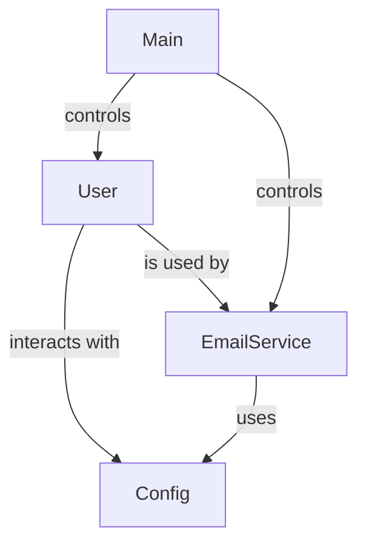

# Improved Architecture Documentation

## 1. Overview
This document provides a comprehensive overview of the architecture of a user email service application. The system is designed to manage user information, generate personalized email templates, and send welcome emails to users. The architecture is modular, separating concerns into distinct classes and functions, which enhances maintainability and scalability. Key classes include `User`, `Config`, and `EmailService`.

## 2. Architecture
The system employs a layered architecture pattern, with distinct components for user management, configuration management, and email service handling. Each layer interacts with the others through clearly defined interfaces, promoting a clean separation of concerns.

### Architecture Diagram


## 3. Components

### 3.1. User Class
- **File**: `user.py`
- **Docstring**: Represents a user with contact information.
- **Attributes**:
  - `name: str`: The name of the user.
  - `email: str`: The email address of the user.
  - `address: str`: The physical address of the user.
  - `phone: Optional[str]`: The phone number of the user (optional).
- **Methods**:
  - `__post_init__(self)`: Validate user data after initialization.
  - `get_full_name(self) -> str`: Return the full name of the user.
  - `get_greeting(self) -> str`: Generate a personalized greeting for the user.
  - `to_dict(self) -> dict`: Convert the user object to a dictionary.

### 3.2. Config Class
- **File**: `config.py`
- **Docstring**: Configuration class for email service settings.
- **Attributes**:
  - `default_template: str`: Default email template used if a specific template is not found.
- **Methods**:
  - `get_email_template(cls, user_name: str, address: str) -> str`: Generate a personalized email template using the provided `user_name` and `address`. Raises an exception if the template is not found.
  - `get_config_dict(cls) -> Dict[str, any]`: Return the configuration as a dictionary.

### 3.3. EmailService Class
- **File**: `email_service.py`
- **Docstring**: Service for sending personalized welcome emails.
- **Methods**:
  - `__init__(self, smtp_server: str, smtp_port: int)`: Initialize the email service with SMTP configuration.
  - `create_welcome_email(self, user: User) -> MIMEMultipart`: Create a personalized welcome email for the user.
  - `send_email(self, user: User, dry_run: bool) -> bool`: Send the welcome email to the user. If `dry_run` is `True`, the email will not be sent, allowing for testing without actual delivery. Handles exceptions during the sending process and logs errors.
  - `send_bulk_emails(self, users: List[User], dry_run: bool) -> dict`: Send welcome emails to multiple users. If `dry_run` is `True`, the method will simulate sending emails and return a summary of actions taken, while also logging any errors encountered.

### 3.4. Main Functions
- **File**: `main.py`
- **Functions**:
  - `get_user_input() -> User`: Collect user information from command line input and return a `User` object.
  - `display_user_info(user: User) -> None`: Display user information for confirmation.
  - `send_welcome_email(user: User, dry_run: bool) -> bool`: Send a welcome email to the user.
  - `process_batch_users(users: List[User], dry_run: bool) -> dict`: Process multiple users and send welcome emails.
  - `main()`: Main application function that orchestrates the application flow, initializing components and handling user input.
  - `demo_batch_mode()`: Demonstrate batch email processing with sample users.

### 3.5. Init File
- **File**: `__init__.py`
- **Purpose**: This file is used to initialize the package, allowing the modules within this directory to be imported as a single package.

## 4. Data Flow
The data flow within the system follows these steps:
1. User inputs their information through the `get_user_input()` function, which returns a `User` object.
2. The user information can be displayed using the `display_user_info(user)` function for confirmation.
3. To send a welcome email, the `send_welcome_email(user, dry_run)` function is called, which utilizes the `EmailService` class to handle the sending process.
4. For batch processing, multiple users can be processed using the `process_batch_users(users, dry_run)` function, which sends welcome emails to all users listed.

### Data Flow Diagram
```mermaid
graph TD;
    A[get_user_input()] --> B[User Object]
    B --> C[display_user_info(user)]
    B --> D[send_welcome_email(user, dry_run)]
    E[process_batch_users(users, dry_run)] --> F[Send Emails]
```

## 5. Dependencies
The system relies on the following external libraries:
- `typing`
- `dataclasses`
- `os`
- `smtplib`
- `email.mime.text`
- `email.mime.multipart`
- `logging`

## 6. Key Design Patterns
The following design patterns are evident in the code structure:
- **Factory Pattern**: The `EmailService` class can be seen as a factory that generates and sends emails based on user data.
- **Singleton Pattern**: The `Config` class can be implemented as a singleton to ensure that configuration is consistent throughout the application.

## 7. Extension Points
To extend the system:
- New user attributes can be added to the `User` class.
- Additional email templates can be created by modifying the `get_email_template(cls, user_name: str, address: str) -> str` method in the `Config` class.
- New email sending strategies can be implemented in the `EmailService` class, such as adding support for different email providers or formats.

## 8. Error Handling
The application includes error handling mechanisms, particularly within the `send_email` and `send_bulk_emails` methods of the `EmailService` class. If an error occurs while sending an email, the application logs the error details for further analysis and continues processing other emails in the case of bulk sending. Specific exceptions, such as connection errors and template not found errors, are caught and logged, ensuring that one failure does not disrupt the entire email sending process.

This documentation outlines the essential components and their interactions in the user email service application, providing a clear understanding of its architecture and capabilities.