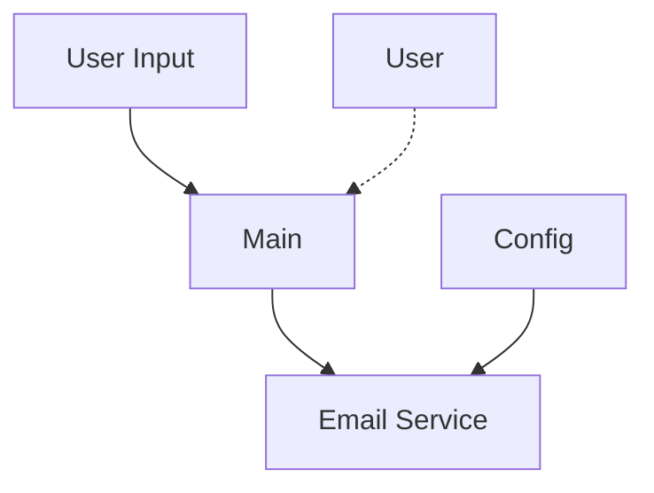
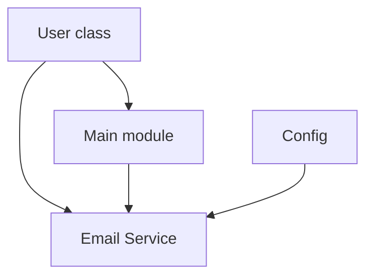

Architecture Documentation

This document presents an architectural view of the codebase based on the explicitly exposed surface (classes, methods, and attributes shown below). No APIs, methods, or attributes not shown below have been added.

1) Overview

The system is a lightweight, CLI-driven welcome-email application with a small, well-defined surface. Its responsibilities include:
- A data model for users
- A configuration/template provider
- An email service responsible for composing and (optionally) sending emails
- A main orchestration layer that gathers input, confirms data, and triggers email sending (including batch processing)

Key interacting components are organized into a simple, layered structure:
- User data is modeled by the User class.
- Email content templates and configuration are provided by the Config class.
- Email creation and dispatch are performed by the EmailService class.
- The main module (main.py) orchestrates user input, confirmation, and both single and batch email sending.

2) Architecture

- Layered architecture with a clear separation of concerns:
  - Data Model Layer: User
  - Configuration/Template Layer: Config
  - Email Sending Layer: EmailService
  - Orchestration/CLI Layer: Functions in main.py (get_user_input, display_user_info, send_welcome_email, process_batch_users, main, demo_batch_mode)

- Core responsibilities:
  - User: Represents user contact details and provides utility methods.
  - Config: Provides email templates and configuration data.
  - EmailService: Creates and sends emails (including bulk sending) using the given SMTP configuration.
  - main.py: Collects input, presents information for confirmation, and coordinates single or batch email sending.

- Relationships:
  - EmailService depends on Config for template data and on User for recipient details.
  - Main uses EmailService to perform sending operations and uses User as the data model for recipients.
  - The project is organized as a small package where modules config, user, and email_service are imported by __init__.py, and main.py uses them to perform application logic.

- Design patterns evident:
  - Data Class / DTO pattern for User: encapsulates user data with a post-initialization validation hook.
  - Separation of Concerns: distinct modules for data modeling (User), configuration/templates (Config), and email operations (EmailService).
  - Thin orchestration layer: main.py coordinates input, confirmation, and calls to the EmailService.

3) Components

3.1 user.py

Class: User
- Attributes:
  - name: str
  - email: str
  - address: str
  - phone: Optional[str]

- Methods:
  - __post_init__(self)
    Post-initialization hook to validate user data.
  - get_full_name(self) -> str
    Return the full name of the user.
  - get_greeting(self) -> str
    Generate a personalized greeting for the user.
  - to_dict(self) -> dict
    Convert the user object to a dictionary.

Notes:
- The User class is defined with the attributes name, email, address, and an optional phone.
- The __post_init__ method provides post-initialization validation.

3.2 config.py

Class: Config
- Docstring: Configuration class for email service settings.
- Methods:
  - get_email_template(cls, user_name, address) -> str
    Generate a personalized email template.
    - Args:
      - user_name: Name of the user
      - address: Address for the email context (e.g., recipient address)
  - get_config_dict(cls) -> Dict[str, any]
    Return configuration data as a dictionary.

Notes:
- get_email_template is a classmethod that accepts user_name and address and returns a string template.
- get_config_dict is a classmethod returning a dictionary with configuration data (keys/structure as Dict[str, any]).

3.3 email_service.py

Class: EmailService
- Docstring: Service for sending personalized welcome emails.
- Methods:
  - __init__(self, smtp_server, smtp_port)
    Initialize email service with SMTP configuration.
    - Args:
      - smtp_server: SMTP server address
      - smtp_port: SMTP server port

  - create_welcome_email(self, user) -> MIMEMultipart
    Create a personalized welcome email for the user.
    - Args:
      - user: User object containing recipient details

  - send_email(self, user, dry_run) -> bool
    Send welcome email to the user.
    - Args:
      - user: User object containing recipient information
      - dry_run: If True, simulate sending without dispatching

  - send_bulk_emails(self, users, dry_run) -> dict
    Send welcome emails to multiple users.
    - Args:
      - users: List of User objects
      - dry_run: If True, simulate sending without dispatching

Notes:
- EmailService is responsible for producing a MIMEMultipart email and dispatching it, with support for a dry_run mode.
- The class relies on SMTP configuration provided at initialization and interacts with User objects for recipient data.

3.4 main.py

Module: main.py

Functions:
- get_user_input() -> User
  - Collect user information from command line input.
  - Returns:
    - User object with provided information

- display_user_info(user) -> None
  - Display user information for confirmation.
  - Args:
    - user: User object to display

- send_welcome_email(user, dry_run) -> bool
  - Send welcome email to the user.
  - Args:
    - user: User object containing recipient information
    - dry_run: If True, perform a dry run without sending

- process_batch_users(users, dry_run) -> dict
  - Process multiple users and send welcome emails.
  - Args:
    - users: List of User objects
    - dry_run: If True, perform a dry run without sending

- main()
  - Main application function.

- demo_batch_mode()
  - Demonstrate batch email processing with sample users.

Notes:
- The main module provides both single-recipient flow (get_user_input, display_user_info, send_welcome_email) and batch flow (process_batch_users, demo_batch_mode).
- The signatures shown above must be used exactly as provided.

4) Data Flow

- Single-user flow:
  - get_user_input() -> User
  - display_user_info(user)
  - send_welcome_email(user, dry_run) -> bool
  - The EmailService (invoked within send_welcome_email) uses the User data to create and send a personalized email, with dry_run controlling actual sending.

- Batch flow:
  - process_batch_users(users, dry_run) -> dict
  - For each User in users, the flow would involve creating and sending emails via the EmailService, controlled by dry_run.
  - The return value is a dictionary describing the outcome for the batch.

- Data relations:
  - User object is the central data carrier for recipient information across single and batch email sending.
  - Config provides email templates used by EmailService to compose messages.
  - EmailService consumes User data and Config templates to generate and (optionally) dispatch emails.
  - Main orchestrates input, display, and dispatch via the EmailService.

- Data movement example (high level):
  - get_user_input() -> User
  - Main passes User to display_user_info(user) and to send_welcome_email(user, dry_run)
  - EmailService uses user (and Config templates) to produce and optionally send the email
  - For batches, process_batch_users(users, dry_run) -> dict coordinates sending across multiple User objects via EmailService

5) Dependencies

External libraries / modules imported (as shown in the code structure):
- Python Standard Library
  - logging
  - os
  - typing
  - smtplib
  - dataclasses
  - email.mime.text
  - email.mime.multipart

- Local / Project Modules
  - config
  - user
  - email_service

- Runtime environment
  - The code references SMTP-related operations via EmailService, implying runtime access to an SMTP host when not in dry_run mode.

6) Mermaid Diagrams

Below are Mermaid diagrams representing the architecture and relationships. Use these in documentation renderers that support Mermaid.

System Architecture Diagram (system-level components)



Component Relationships Diagram (module-level dependencies)



Data Flow Diagram (single and batch email flow)

```mermaid
graph TD
  A[GetUserInput()] --> B[User]
  B --> C[DisplayUserInfo()]
  B --> D[send_welcome_email(user, dry_run)]
  D --> E[EmailService]
  F[ProcessBatchUsers()] --> E
```

7) Key Design Patterns

- Data Class / Data Transfer Object (DTO)
  - User is modeled with a dataclass-like pattern (implied by __post_init__), encapsulating name, email, address, and optional phone.

- Separation of Concerns
  - Distinct modules handle data (User), configuration/templates (Config), and sending logic (EmailService), with a lightweight orchestration layer in main.py.

- Single Responsibility for EmailService
  - EmailService encapsulates email creation (create_welcome_email) and sending (send_email, send_bulk_emails), separated from template/config logic.

- Template/Configuration Centralization
  - Config provides get_email_template and get_config_dict, centralizing templates and configuration for email construction and behavior.

8) Extension Points

- Email templates and configurations can be extended via Config.get_email_template and Config.get_config_dict to support additional user data or template variants.

- Email sending capabilities can be extended by enhancing EmailService:
  - Existing methods include create_welcome_email, send_email, and send_bulk_emails. Additional sending modes or recipient handling could be added while preserving the current interface.

- CLI enhancements in main.py:
  - The current functions (get_user_input, display_user_info, send_welcome_email, process_batch_users, demo_batch_mode) provide entry points for extension, e.g., adding more batch scenarios, richer input validation, or additional dry_run reporting.

If you’d like, I can tailor these diagrams to a specific documentation format or export them to a particular doc framework (e.g., Sphinx, MkDocs) while preserving the exact API surface described here.